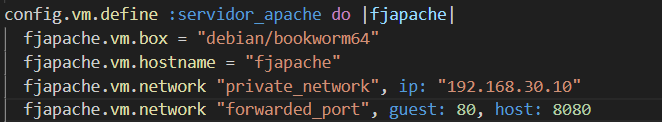
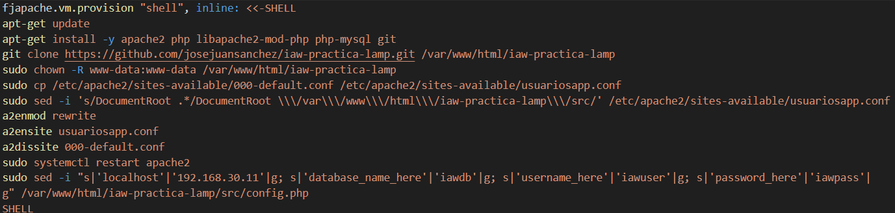
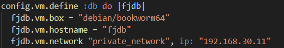
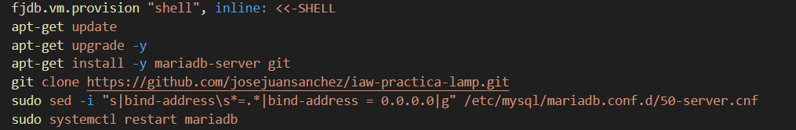
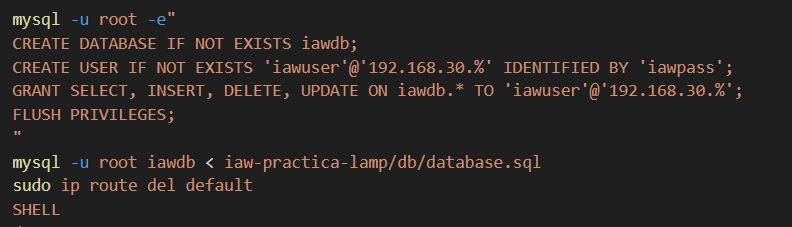
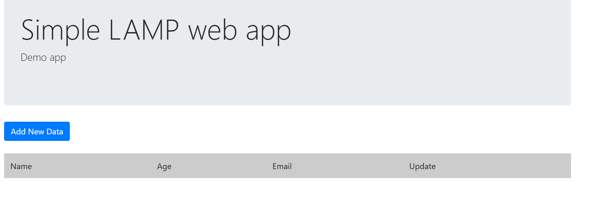
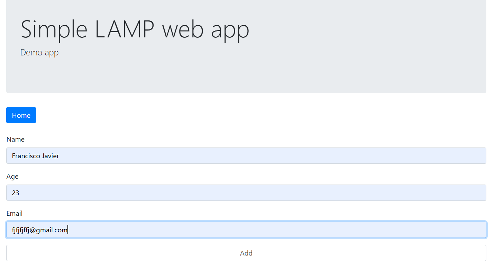
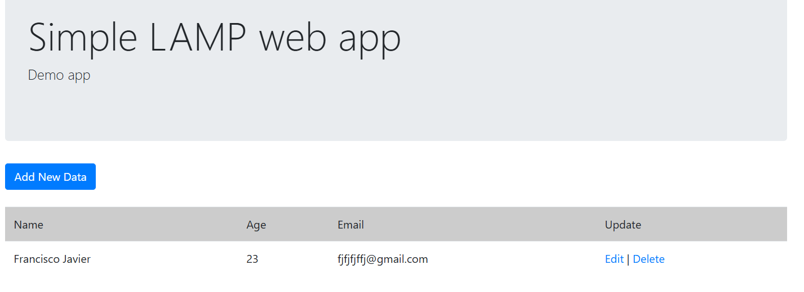

# Practica1_implantacion
Esta es la primera practica de implantación web. Consiste en un entorno vagrant constituido por dos maquinas donde una un servidor apache y la otra una base de datos mariadb. Donde podrás modificar la base de datos mediante un html en tu navegador. 
# 📘 Explicación del Proyecto Vagrant (LAMP con Apache y MariaDB)

Este proyecto crea un entorno de desarrollo **LAMP**  automatizado con **Vagrant** y **VirtualBox**.  
El entorno está compuesto por **dos máquinas virtuales**:

-  **Web** → Servidor Apache + PHP  
-  **DB** → Servidor MariaDB

---

##  1. Vagrantfile

El archivo Vagrantfile define las dos máquinas virtuales y su configuración.
```
 # -*- mode: ruby -*-
 vi: set ft=ruby :
# All Vagrant configuration is done below. The "2" in Vagrant.configure
# configures the configuration version (we support older styles for
# backwards compatibility). Please don't change it unless you know what
# you're doing.
Vagrant.configure("2") do |config|
  # The most common configuration options are documented and commented below.
  # For a complete reference, please see the online documentation at
  # https://docs.vagrantup.com.

  # Every Vagrant development environment requires a box. You can search for
  # boxes at https://vagrantcloud.com/search.

config.vm.define :servidor_apache do |fjapache|
  fjapache.vm.box = "debian/bookworm64"
  fjapache.vm.hostname = "fjapache"
  fjapache.vm.network "private_network", ip: "192.168.30.10"
  fjapache.vm.network "forwarded_port", guest: 80, host: 8080
  fjapache.vm.provision "shell", inline: <<-SHELL 
  apt-get update
  apt-get install -y apache2 php libapache2-mod-php php-mysql git
  git clone https://github.com/josejuansanchez/iaw-practica-lamp.git /var/www/html/iaw-practica-lamp
  sudo chown -R www-data:www-data /var/www/html/iaw-practica-lamp
  sudo cp /etc/apache2/sites-available/000-default.conf /etc/apache2/sites-available/usuariosapp.conf
  sudo sed -i 's/DocumentRoot .*/DocumentRoot \\\/var\\\/www\\\/html\\\/iaw-practica-lamp\\\/src/' /etc/apache2/sites-available/usuariosapp.conf
  a2enmod rewrite
  a2ensite usuariosapp.conf
  a2dissite 000-default.conf
  sudo systemctl restart apache2
  sudo sed -i "s|'localhost'|'192.168.30.11'|g; s|'database_name_here'|'iawdb'|g; s|'username_here'|'iawuser'|g; s|'password_here'|'iawpass'|g" /var/www/html/iaw-practica-lamp/src/config.php
  SHELL
end

config.vm.define :db do |fjdb|
  fjdb.vm.box = "debian/bookworm64"
  fjdb.vm.hostname = "fjdb"
  fjdb.vm.network "private_network", ip: "192.168.30.11"
  fjdb.vm.provision "shell", inline: <<-SHELL
  apt-get update
  apt-get upgrade -y
  apt-get install -y mariadb-server git
  git clone https://github.com/josejuansanchez/iaw-practica-lamp.git
  sudo sed -i "s|bind-address\s*=.*|bind-address = 0.0.0.0|g" /etc/mysql/mariadb.conf.d/50-server.cnf
  sudo systemctl restart mariadb

  mysql -u root -e"
  CREATE DATABASE IF NOT EXISTS iawdb;
  CREATE USER IF NOT EXISTS 'iawuser'@'192.168.30.%' IDENTIFIED BY 'iawpass';
  GRANT SELECT, INSERT, DELETE, UPDATE ON iawdb.* TO 'iawuser'@'192.168.30.%';
  FLUSH PRIVILEGES;
  "
  mysql -u root iawdb < iaw-practica-lamp/db/database.sql
  sudo ip route del default
  SHELL
end
# Disable automatic box update checking. If you disable this, then
# boxes will only be checked for updates when the user runs
# `vagrant box outdated`. This is not recommended.
# config.vm.box_check_update = false

# Create a forwarded port mapping which allows access to a specific port
# within the machine from a port on the host machine. In the example below,
# accessing "localhost:8080" will access port 80 on the guest machine.
# NOTE: This will enable public access to the opened port
# config.vm.network "forwarded_port", guest: 80, host: 8080

# Create a forwarded port mapping which allows access to a specific port
# within the machine from a port on the host machine and only allow access
# via 127.0.0.1 to disable public access
# config.vm.network "forwarded_port", guest: 80, host: 8080, host_ip: "127.0.0.1"

# Create a private network, which allows host-only access to the machine
# using a specific IP.
# config.vm.network "private_network", ip: "192.168.33.10"

# Create a public network, which generally matched to bridged network.
# Bridged networks make the machine appear as another physical device on
# your network.
# config.vm.network "public_network"

# Share an additional folder to the guest VM. The first argument is
# the path on the host to the actual folder. The second argument is
# the path on the guest to mount the folder. And the optional third
# argument is a set of non-required options.
# config.vm.synced_folder "../data", "/vagrant_data"

# Disable the default share of the current code directory. Doing this
# provides improved isolation between the vagrant box and your host
# by making sure your Vagrantfile isn't accessible to the vagrant box.
# If you use this you may want to enable additional shared subfolders as
# shown above.
# config.vm.synced_folder ".", "/vagrant", disabled: true

# Provider-specific configuration so you can fine-tune various
# backing providers for Vagrant. These expose provider-specific options.
# Example for VirtualBox:
#
# config.vm.provider "virtualbox" do |vb|
#   # Display the VirtualBox GUI when booting the machine
#   vb.gui = true
#
#   # Customize the amount of memory on the VM:
#   vb.memory = "1024"
# end
#
# View the documentation for the provider you are using for more
# information on available options.

 Enable provisioning with a shell script. Additional provisioners such as
 Ansible, Chef, Docker, Puppet and Salt are also available. Please see the
 documentation for more information about their specific syntax and use.
 config.vm.provision "shell", inline: <<-SHELL
   apt-get update
   apt-get install -y apache2
 SHELL
end
```

###  Máquina servidor_apache (`fjapache`)
Esta VM instala **Apache**, **PHP** y descarga una aplicación desde GitHub.

#### Configuración principal:
```ruby
config.vm.define :servidor_apache do |fjapache|
  fjapache.vm.box = "debian/bookworm64"
  fjapache.vm.hostname = "fjapache"
  fjapache.vm.network "private_network", ip: "192.168.30.10"
  fjapache.vm.network "forwarded_port", guest: 80, host: 8080
```


- **IP privada:** `192.168.30.10`  
- **Puerto 8080 del host** → se conecta al **puerto 80 del invitado** (Apache).  
- Permite acceder al servidor web desde el navegador usando `http://localhost:8080`.

#### Provisión:
Se ejecuta un **script**
```bash
fjapache.vm.provision "shell", inline: <<-SHELL 
  apt-get update
  apt-get install -y apache2 php libapache2-mod-php php-mysql git
  git clone https://github.com/josejuansanchez/iaw-practica-lamp.git /var/www/html/iaw-practica-lamp
  sudo chown -R www-data:www-data /var/www/html/iaw-practica-lamp
  sudo cp /etc/apache2/sites-available/000-default.conf /etc/apache2/sites-available/usuariosapp.conf
  sudo sed -i 's/DocumentRoot .*/DocumentRoot \\\/var\\\/www\\\/html\\\/iaw-practica-lamp\\\/src/' /etc/apache2/sites-available/usuariosapp.conf
  a2enmod rewrite
  a2ensite usuariosapp.conf
  a2dissite 000-default.conf
  sudo systemctl restart apache2
  sudo sed -i "s|'localhost'|'192.168.30.11'|g; s|'database_name_here'|'iawdb'|g; s|'username_here'|'iawuser'|g; s|'password_here'|'iawpass'|g" /var/www/html/iaw-practica-lamp/src/config.php
  SHELL
  ```
que:

1. Actualiza los repositorios.
2. Instala `apache2`, `php`, `libapache2-mod-php`, `php-mysql` y `git`.
3. Clona el repositorio de práctica desde GitHub.
4. Cambia los permisos del directorio web.
5. Configura un nuevo VirtualHost (`usuariosapp.conf`).
6. Habilita `mod_rewrite` y el nuevo sitio.
7. Modifica `config.php` con los datos de conexión a la base de datos:
   - Host: `192.168.30.11`  
   - Base de datos: `iawdb`  
   - Usuario: `iawuser`  
   - Contraseña: `iawpass`


---

### Máquina Base de Datos (`db`)

Configura el servidor **MariaDB** y permite conexiones remotas desde la máquina web.

#### Configuración principal:
```ruby
config.vm.define :db do |fjdb|
  fjdb.vm.box = "debian/bookworm64"
  fjdb.vm.hostname = "fjdb"
  fjdb.vm.network "private_network", ip: "192.168.30.11"
```



- **IP privada:** `192.168.30.11`


#### Provisión:
Ejecuta un script 
```bash
fjdb.vm.provision "shell", inline: <<-SHELL
  apt-get update
  apt-get upgrade -y
  apt-get install -y mariadb-server git
  git clone https://github.com/josejuansanchez/iaw-practica-lamp.git
  sudo sed -i "s|bind-address\s*=.*|bind-address = 0.0.0.0|g" /etc/mysql/mariadb.conf.d/50-server.cnf
  sudo systemctl restart mariadb

  mysql -u root -e"
  CREATE DATABASE IF NOT EXISTS iawdb;
  CREATE USER IF NOT EXISTS 'iawuser'@'192.168.30.%' IDENTIFIED BY 'iawpass';
  GRANT SELECT, INSERT, DELETE, UPDATE ON iawdb.* TO 'iawuser'@'192.168.30.%';
  FLUSH PRIVILEGES;
  "
  mysql -u root iawdb < iaw-practica-lamp/db/database.sql
  sudo ip route del default
  SHELL
```
que:

1. Actualiza repositorios e instala **MariaDB** y **Git**.  
2. Clona el mismo repositorio desde GitHub.  
3. Permite acceso remoto a la base de datos (`bind-address = 0.0.0.0`).  
4. Crea la base de datos `iawdb`.  
5. Crea el usuario `iawuser` con permisos sobre esa base.  
6. Importa los datos iniciales desde `database.sql`.  
7. Elimina la ruta por defecto de red para **evitar acceso a Internet** desde la VM (seguridad).




---

##  2. Script: `script-apache.sh`

```bash
#!/bin/bash
# Actualizamos e instalamos Apache, PHP y Git
apt-get update
apt-get install -y apache2 php libapache2-mod-php php-mysql git

# Clonamos el proyecto web
git clone https://github.com/josejuansanchez/iaw-practica-lamp.git /var/www/html/iaw-practica-lamp

# Asignamos permisos
chown -R www-data:www-data /var/www/html/iaw-practica-lamp

# Configuramos Apache
cp /etc/apache2/sites-available/000-default.conf /etc/apache2/sites-available/usuariosapp.conf
sed -i 's/DocumentRoot .*/DocumentRoot \/var\/www\/html\/iaw-practica-lamp\/src/' /etc/apache2/sites-available/usuariosapp.conf

# Activamos módulos y sitio
a2enmod rewrite
a2ensite usuariosapp.conf
a2dissite 000-default.conf
systemctl restart apache2

# Configuramos la conexión a la base de datos
sed -i "s|'localhost'|'192.168.30.11'|g; s|'database_name_here'|'iawdb'|g; s|'username_here'|'iawuser'|g; s|'password_here'|'iawpass'|g" /var/www/html/iaw-practica-lamp/src/config.php
```


##  3. Script: `script-mariadb.sh`

```bash
#!/bin/bash
# Instalamos y configuramos MariaDB
apt-get update
apt-get upgrade -y
apt-get install -y mariadb-server git

# Clonamos el proyecto
git clone https://github.com/josejuansanchez/iaw-practica-lamp.git

# Permitimos conexiones externas
sed -i "s|bind-address\s*=.*|bind-address = 0.0.0.0|g" /etc/mysql/mariadb.conf.d/50-server.cnf
systemctl restart mariadb

# Creamos base de datos y usuario
mysql -u root -e "
CREATE DATABASE IF NOT EXISTS iawdb;
CREATE USER IF NOT EXISTS 'iawuser'@'192.168.30.%' IDENTIFIED BY 'iawpass';
GRANT SELECT, INSERT, DELETE, UPDATE ON iawdb.* TO 'iawuser'@'192.168.30.%';
FLUSH PRIVILEGES;"

# Importamos datos
mysql -u root iawdb < iaw-practica-lamp/db/database.sql

# Bloqueamos salida a internet
ip route del default
```
---
## Observaciones
En mi máquina hay un problema con los scripts. Utilizando la siguiente linea de código:
`config.vm.provision "shell", path: "script.sh"`
(en el caso de mi vagrantfile)
`fjapache.vm.provision "shell", path: "script-apache.sh"`
y
`fjadb.vm.provision "shell", path: "script-mariadb.sh"`
se puede aprovisionar a las maquinas sin la necesidad de especificar el código del script en el código del vagrantfile.
En mi caso no funciona si utilizas los scripst desde fuera del código e investigando he llegado a la conclusion que es un problema de permisos, que en Linux se podrá solucionar, probablemente, con el uso del comando chmod.
Es importante saber que todas las ips deben de encontrarse en la misma red ( en mi caso 192.168.30.0), si se cambia las ip no funcionara. Es importante también saber que si colocamos un "%" al final de una ip tal y como yo lo tengo puesto a la hora del login en la DB (192.168.30.%) le indicamos a máquina que puede ser cualquier ip que sustituya el % por un número valido.
Dentro del repositorio tambien se encontrara un vídeo con el funcionamiento del html y un ejemplo sencillo de su uso. A su vez si desea ver la DB desde la terminal puede hacer un `vagrant ssh fjdb`, hacer login con root en la DB usando ( `mysql -u root iawdb < iaw-practica-lamp/db/database.sql`) y hacer una consulta simple como `Select * from users` para ver los cambios de la DB en tiempo real.

---

## Resultado final

Después de ejecutar:
```bash
vagrant up
```

- La aplicación web estará disponible en:  
   [http://localhost:8080](http://localhost:8080)
  
  
  
- Apache servirá los archivos PHP.  
- MariaDB estará lista y conectada a la app.  
